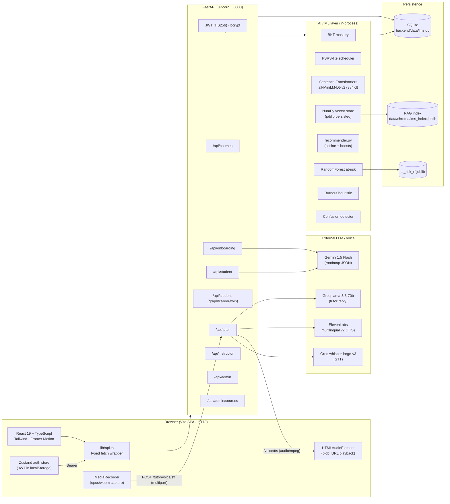
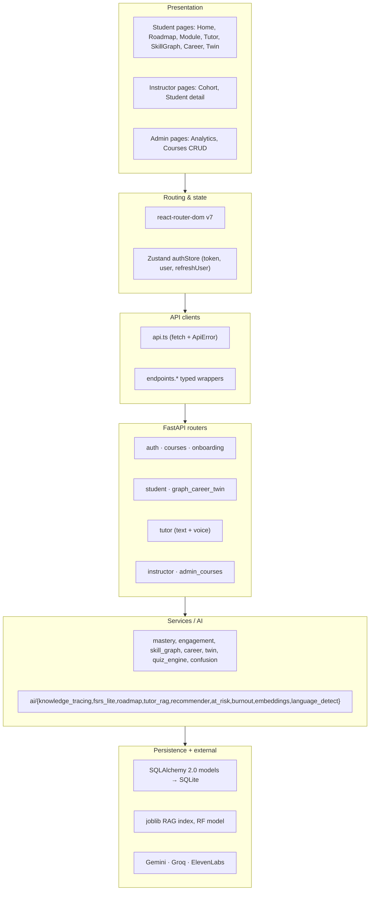
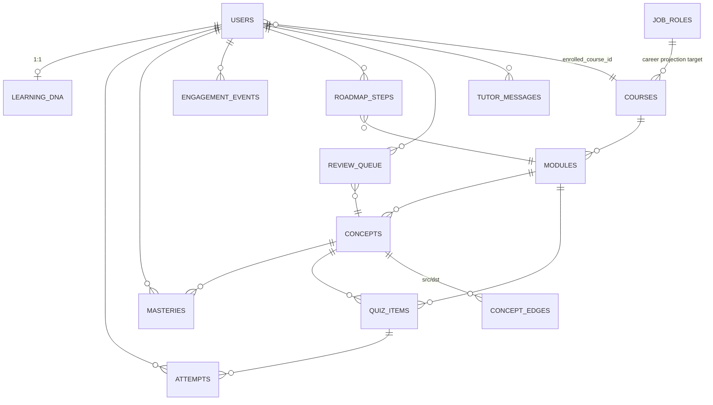
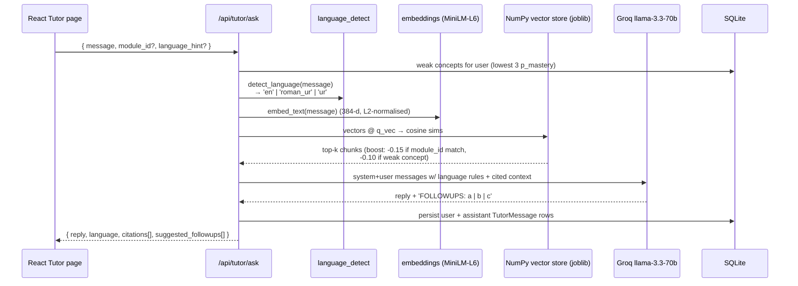
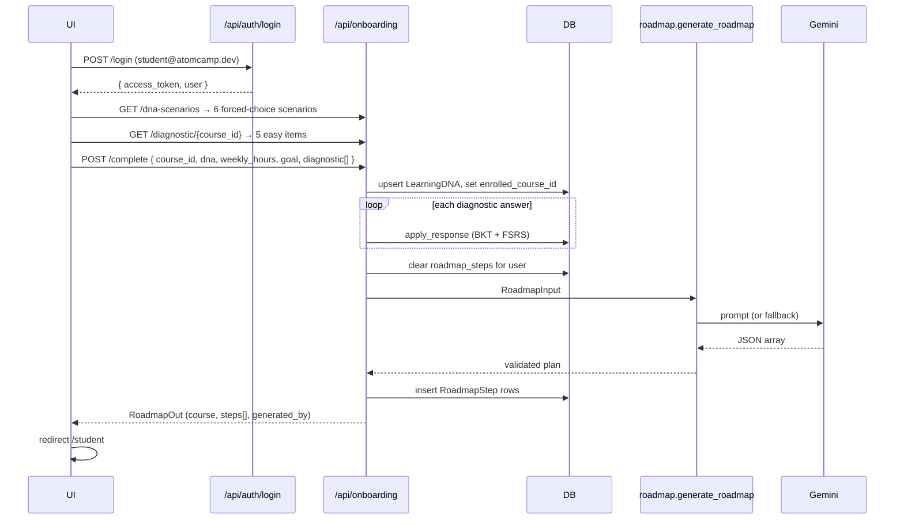
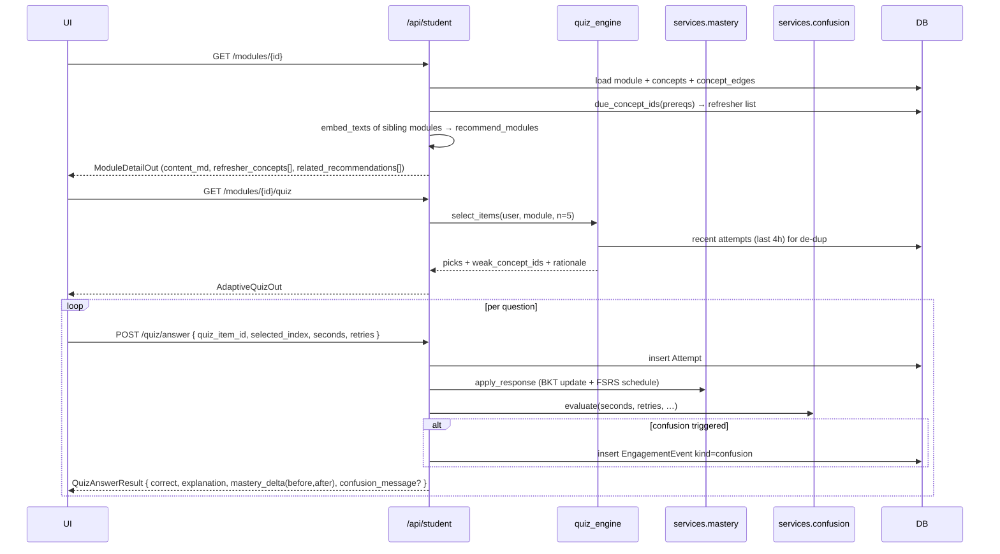

# atomcamp Smart Adaptive LMS

A full-stack, AI-native Learning Management System built for the **ITU AI Hackathon 2026**
(team **Aurex26**, repo `Aurex26--ITU-AI-HACKATHON--Saram`).

It personalises every part of the learning loop — what you study next, how the tutor
explains it, how quizzes adapt to your weak spots, how instructors spot at-risk
learners, and how admins steer the catalogue — using a five-dimensional cognitive
**Learning DNA**, classical educational ML (BKT, FSRS), modern LLMs (Gemini, Groq),
and ElevenLabs voice for an Urdu/English code-switching tutor.

---

## Table of contents

1. [TL;DR / what's in the box](#1-tldr--whats-in-the-box)
2. [System architecture](#2-system-architecture)
3. [Repository layout](#3-repository-layout)
4. [Tech stack](#4-tech-stack)
5. [Core domain model](#5-core-domain-model)
6. [AI / ML subsystems (with examples)](#6-ai--ml-subsystems-with-examples)
7. [Voice subsystem (ElevenLabs + Groq Whisper)](#7-voice-subsystem-elevenlabs--groq-whisper)
8. [Frontend architecture](#8-frontend-architecture)
9. [End-to-end flows](#9-end-to-end-flows)
10. [API reference (with curl examples)](#10-api-reference-with-curl-examples)
11. [Local setup](#11-local-setup)
12. [Configuration / environment](#12-configuration--environment)
13. [Operational notes](#13-operational-notes)
14. [Troubleshooting](#14-troubleshooting)

---

## 1. TL;DR / what's in the box

| Capability | How it's done | Where |
|---|---|---|
| **Personalised roadmap** | Gemini 1.5 Flash JSON plan, validated by Pydantic; deterministic rule-based fallback always available | `backend/app/ai/roadmap.py` |
| **Adaptive quiz selection** | BKT mastery → target item difficulty (zone of proximal development); recency-aware item picker | `backend/app/ai/knowledge_tracing.py`, `backend/app/services/quiz_engine.py` |
| **Per-concept mastery tracking** | 4-parameter Bayesian Knowledge Tracing on every answer | `backend/app/ai/knowledge_tracing.py`, `backend/app/services/mastery.py` |
| **Spaced repetition** | FSRS-lite: SM-2 ease + exponential forgetting curve | `backend/app/ai/fsrs_lite.py` |
| **AI tutor (RAG, code-switch)** | Sentence-Transformers embeddings → NumPy in-memory vector store with module/concept boosts → Groq llama-3.3-70b → cited reply | `backend/app/ai/tutor_rag.py`, `backend/app/ai/embeddings.py`, `backend/app/ai/language_detect.py` |
| **Voice loop (talk + listen)** | ElevenLabs `eleven_multilingual_v2` for TTS; Groq `whisper-large-v3` for STT (Urdu + English auto-detect) | `backend/app/routers/tutor.py`, `frontend/src/pages/StudentTutor.tsx` |
| **Skill graph** | Concept prerequisite DAG joined with per-user mastery → 3-state nodes (locked / learning / mastered) | `backend/app/services/skill_graph.py` |
| **Career simulator** | Mastery projection over 4/12/24 weeks vs. seeded **Pakistan PKR** salary roles | `backend/app/services/career.py` |
| **Peer Twin** | Cosine similarity over (mastery vector ⊕ ½·DNA), ranked by "modules ahead" | `backend/app/ai/recommender.py`, `backend/app/services/twin.py` |
| **At-risk classifier (explainable)** | scikit-learn RandomForest on synthetic engagement cohort; per-prediction top-2 reasons | `backend/app/ai/at_risk.py` |
| **Burnout signal** | Multi-cue heuristic: weekly-minutes drop + long-session-low-accuracy + tutor frustration markers (English + Roman Urdu) | `backend/app/ai/burnout.py` |
| **Confusion detector** | Live signal during quiz: time-on-task, retries, scroll reversals, idle, correctness | `backend/app/services/confusion.py` |
| **Course CRUD (admin)** | Slug-deduped course/module/concept management; everything downstream auto-follows | `backend/app/routers/admin_courses.py` |

Three demo accounts seeded at startup:

| Role | Email | Password |
|---|---|---|
| Student | `student@atomcamp.dev` | `student123` |
| Instructor | `instructor@atomcamp.dev` | `instructor123` |
| Admin | `admin@atomcamp.dev` | `admin123` |

---

## 2. System architecture



### Layered view



### Process / threading

* **Single uvicorn process** with `--reload`. SQLite uses `check_same_thread=False`.
* The **embedding model** and the **RandomForest** are lazy-loaded once per process and protected by a `threading.Lock`.
* External calls (Gemini / Groq / ElevenLabs) are invoked through `httpx.Client` (sync) inside FastAPI thread-pool tasks — no async transport is required because the workload is bursty per-request, not high-throughput streaming.

---

## 3. Repository layout

```
Aurex26--ITU-AI-HACKATHON--Saram/
├── README.md                       <-- you are here
├── backend/
│   ├── .env / .env.example
│   ├── requirements.txt
│   ├── data/                       SQLite + joblib artifacts (RAG, RF model)
│   │   ├── lms.db
│   │   ├── at_risk_rf.joblib
│   │   └── chroma/lms_index.joblib
│   └── app/
│       ├── main.py                 FastAPI factory + CORS + /api/health
│       ├── bootstrap.py            startup orchestration: init DB, seed, RAG index, warm RF
│       ├── config.py               pydantic-settings, has_gemini/has_groq/has_elevenlabs flags
│       ├── database.py             SQLAlchemy engine + SessionLocal + Base
│       ├── auth.py                 bcrypt + JWT + role guards
│       ├── models/core.py          all ORM tables (one module by design)
│       ├── schemas/                Pydantic I/O DTOs (auth, courses, learner, quiz, tutor, instructor)
│       ├── ai/
│       │   ├── knowledge_tracing.py  BKT update_mastery / difficulty_for_mastery
│       │   ├── fsrs_lite.py          schedule_next, retrievability, is_due
│       │   ├── embeddings.py         lazy SentenceTransformer (MiniLM-L6, 384-d)
│       │   ├── tutor_rag.py          IndexChunk, retrieve(), answer() w/ Groq
│       │   ├── language_detect.py    EN / Roman Urdu / Urdu detector + system prompts
│       │   ├── roadmap.py            Gemini JSON plan + rule-based fallback
│       │   ├── recommender.py        Module recs + Peer Twin matcher
│       │   ├── at_risk.py            RandomForest + per-prediction explanation
│       │   └── burnout.py            multi-signal heuristic w/ Roman-Urdu keywords
│       ├── services/
│       │   ├── mastery.py            apply_response (BKT + FSRS write-through)
│       │   ├── quiz_engine.py        adaptive item selection
│       │   ├── confusion.py          live confusion verdict
│       │   ├── engagement.py         feature builders for at-risk + burnout
│       │   ├── skill_graph.py        concept DAG + mastery state
│       │   ├── career.py             mastery projection + role match
│       │   └── twin.py               peer twin discovery
│       ├── routers/
│       │   ├── auth.py               /api/auth/{login,register,me,demo-accounts}
│       │   ├── courses.py            /api/courses (public)
│       │   ├── onboarding.py         /api/onboarding/{dna-scenarios,diagnostic,complete}
│       │   ├── student.py            /api/student/* (roadmap, dna, mastery, modules, quiz, switch)
│       │   ├── graph_career_twin.py  /api/student/{skill-graph,career,twin}
│       │   ├── tutor.py              /api/tutor/{ask,history,voice/{status,tts,stt}}
│       │   ├── instructor.py         /api/instructor/* + /api/admin/analytics
│       │   └── admin_courses.py      /api/admin/courses CRUD
│       └── seed/                     content + 6-student cohort + simulated history
└── frontend/
    ├── package.json (Vite 6 + React 19)
    ├── tailwind.config.js (custom aqua/mint palette + 'Times New Roman' display)
    ├── vite.config.ts (proxies /api -> 127.0.0.1:8000)
    └── src/
        ├── main.tsx · App.tsx (routes + Guards)
        ├── lib/
        │   ├── api.ts (typed fetch wrapper, ApiError, all endpoints)
        │   ├── authStore.ts (Zustand)
        │   └── cn.ts (classname helper)
        ├── layout/AppShell.tsx (header + drawer + role-aware nav)
        ├── components/ui/ (Card, Button, Avatar, Toaster, Icon, Skeleton…)
        └── pages/
            ├── Landing/Login/Onboarding
            ├── StudentHome (DNA radar + course switcher + mastery heatmap)
            ├── StudentRoadmap, StudentSkillGraph, StudentCareer, StudentTwin
            ├── ModulePage (content + adaptive quiz)
            ├── StudentTutor (RAG chat + voice loop)
            ├── InstructorHome, InstructorStudent
            └── AdminHome, AdminCourses
```

---

## 4. Tech stack

### Backend (`backend/requirements.txt`)
| Package | Version | Why |
|---|---|---|
| `fastapi` | 0.115.6 | HTTP layer, dependency injection, `/docs` |
| `uvicorn[standard]` | 0.34.0 | ASGI server (`--reload` for dev) |
| `sqlalchemy` | 2.0.36 | ORM with `Mapped[]`/`mapped_column` style |
| `pydantic` / `pydantic-settings` | 2.10.4 / 2.7.0 | Schemas + `.env` typed loader |
| `python-jose[cryptography]` + `bcrypt` | 3.3.0 / 4.2.1 | JWT HS256 + password hashing |
| `httpx` | 0.28.1 | Sync client for Gemini/Groq/ElevenLabs (timeouts, status mapping) |
| `google-generativeai` | 0.8.3 | Gemini 1.5 Flash for roadmap JSON |
| `groq` | 0.15.0 | Groq SDK for the tutor LLM |
| `sentence-transformers` | 3.3.1 | `all-MiniLM-L6-v2` embeddings (384-d) |
| `scikit-learn` | 1.6.0 | RandomForest at-risk model |
| `numpy` / `pandas` | 2.2.1 / 2.2.3 | Vector ops, light tabular |
| `joblib` | 1.4.2 | Persist RAG index + RF model |

### Frontend (`frontend/package.json`)
| Package | Version | Why |
|---|---|---|
| `react` / `react-dom` | 19 | Concurrent renderer, automatic batching |
| `vite` | 6.x | Dev server + bundler with proxy to FastAPI |
| `typescript` | 5.8 | End-to-end types from `lib/api.ts` |
| `tailwindcss` | 3.4 | Custom theme (`aqua` / `mint`, Times serif) |
| `framer-motion` | 12 | Page + nav indicator animations |
| `react-router-dom` | 7 | Nested routes + role guards |
| `zustand` | 5 | Tiny global auth store |
| `react-markdown` + `remark-gfm` | 10 / 4 | Tutor + module content rendering |

---

## 5. Core domain model



**Key tables** (full definitions in `backend/app/models/core.py`):

* `users` — role enum (`student | instructor | admin`), `enrolled_course_id`, `weekly_hours`, `goal`, `prior_experience`, `language_pref`.
* `learning_dna` — 5 floats in [0, 1]: `modality, depth, pace, abstraction, time_of_day` + `as_vector()`.
* `courses → modules → concepts` with `concept_edges` (directed prerequisite DAG, `UNIQUE(src_id, dst_id)`).
* `quiz_items` — MCQs with `difficulty ∈ [0,1]`, `failure_mode` for analytics.
* `attempts` — every answer (correct, seconds, retries) → drives BKT.
* `masteries` — `(user, concept)` posterior `p_mastery` + `last_seen` + `stability_days`.
* `review_queue` — FSRS-lite per `(user, concept)`: `interval_days`, `ease`, `due_at`.
* `engagement_events` — append-only event log: `kind ∈ {module_open, time, session, confusion, course_switch, …}` + JSON payload. Powers risk + burnout analytics.
* `roadmap_steps` — ordered, generated plan; `UNIQUE(user_id, position)`.
* `tutor_messages` — full chat persistence with `role`, `language`, `citations[]`.
* `job_roles` — Pakistan-grounded targets with PKR salary band, `required_concepts[{slug, level}]`, `market_demand`.

---

## 6. AI / ML subsystems (with examples)

### 6.1 Bayesian Knowledge Tracing (BKT)

**File:** `backend/app/ai/knowledge_tracing.py`

Standard 4-parameter formulation:

| Param | Meaning | Default |
|---|---|---|
| `p_l0` | prior P(mastered) before any evidence | 0.30 |
| `p_transit` | P(un-mastered → mastered after a learning opportunity) | 0.15 |
| `p_guess` | P(correct \| un-mastered) | 0.20 |
| `p_slip` | P(incorrect \| mastered) | 0.10 |

**Worked example** (the actual update used in `services/mastery.apply_response`):

```text
Prior P(M) = 0.30, learner answers correctly
  numerator   = 0.30 · (1 − 0.10)        = 0.270
  denominator = 0.270 + (0.70 · 0.20)    = 0.410
  evidence    = 0.270 / 0.410            ≈ 0.6585
  posterior   = 0.6585 + (1 − 0.6585) · 0.15
                                          ≈ 0.7098
  → mastery jumps from 0.30 → 0.71 in one shot
```

`difficulty_for_mastery(p)` returns `p + 0.10` (capped) so the next item lives in the
**zone of proximal development**. This is what the adaptive quiz engine asks for.

### 6.2 FSRS-lite spaced repetition

**File:** `backend/app/ai/fsrs_lite.py`

```python
# rating: 0 forgot · 1 hard · 2 good · 3 easy
schedule_next(prior_interval=2.0, prior_ease=2.5, rating=3)
# → ReviewResult(interval_days = 2.0 · 2.5 · 1.3 = 6.5,
#                ease           = 2.55,
#                due_at         = now + 6.5d)

retrievability(last_seen=now-3d, stability_days=4)
# → exp(-3/4) ≈ 0.47   (i.e. ~47% chance still recallable)
```

`mastery.apply_response` automatically grades each correct answer 1/2/3 based on
post-update mastery, then writes `interval_days`, `ease`, `due_at` and mirrors the
new `interval_days` into `Mastery.stability_days`.

### 6.3 Adaptive quiz engine

**File:** `backend/app/services/quiz_engine.py`

For module *m* and learner *u*:

1. Bucket items by concept.
2. Order concepts by **ascending** mastery (weakest first).
3. For each concept pick the item closest to `difficulty_for_mastery(p_mastery)`.
4. Prefer items not seen in the last 4h (`Attempt.created_at >= utcnow() - 4h`).
5. Fill with random leftovers up to `n=5`.

Returns `(picks, weak_concept_ids, rationale)` — the rationale is what the UI shows
("Focusing on 'Recall' first since your mastery there is the lowest in this module.")

### 6.4 Recommender + Peer Twin

**File:** `backend/app/ai/recommender.py`

* `recommend_modules`: cosine sim between learner-vector and module-vectors, with a small
  boost when the candidate matches the boost set, returning top-k with a human-readable reason.
* `find_peer_twin`: each candidate becomes a vector `[mastery_per_concept | ½·dna]`. Reserved
  keys (anything starting with `__`) are filtered so the structured `__dna__` payload can't
  leak into the mastery slice (this was the cause of the only 500 we saw in
  `/api/student/twin`; the fix is in `recommender.py`).

### 6.5 Roadmap generator

**File:** `backend/app/ai/roadmap.py`

```mermaid
flowchart LR
  A[OnboardingRequest<br/>or course switch] --> B[RoadmapInput<br/>(goal, prior_xp, weekly_hours,<br/>dna, diagnostic, modules)]
  B --> C{Has Gemini key?}
  C -- yes --> D[Build prompt<br/>'every module exactly once']
  D --> E[Gemini 1.5 Flash<br/>generate_content]
  E --> F[_extract_json_array<br/>(handles ```json fences)]
  F --> G[Pydantic validate<br/>RoadmapStepPlan]
  G --> H{All modules<br/>covered?}
  H -- no --> I[Append missing<br/>modules at end]
  H -- yes --> J[Return plan +<br/>source='gemini']
  C -- no --> K[_rule_based_plan<br/>(weekly capacity, DNA tints)]
  K --> J
  E -. exception .-> K
```

The rule-based fallback is **always** correct and ordered — even an LLM outage just
trades a chatty rationale for "Builds directly on what you just completed."

### 6.6 RAG tutor

**File:** `backend/app/ai/tutor_rag.py`



**Why no Chroma?** ~50–200 chunks make a NumPy in-memory store strictly faster, dependency-free
on Windows, and trivially `joblib`-persistable. The store still mimics Chroma semantics
(`reset_collection`, `index_chunks`, metadata-aware retrieval) so it can be swapped without API churn.

**Boosts in numbers:** if a chunk's metadata matches the open module, its distance drops by
0.15 (i.e. its similarity is treated as 0.15 higher). Weak concept matches get an extra 0.10.
Both can stack.

### 6.7 At-risk classifier (explainable)

**File:** `backend/app/ai/at_risk.py`

7 features: `avg_quiz_score, days_since_active, completion_pct, weekly_minutes, mastery_avg,
help_requests, confusion_incidents`.

A `RandomForestClassifier(n_estimators=180, max_depth=6, class_weight='balanced')` is trained
once on a synthetic cohort of 400 learners (noisy logistic ground truth) and persisted to
`backend/data/at_risk_rf.joblib`. **Per-prediction explanation** = `importance · z-score · sign`
(sign mirrors whether the feature is risk-increasing or risk-decreasing); the top 2 positive
contributions are returned as `RiskExplanation(feature, label, contribution)`.

Bands: `high ≥ 0.66`, `medium ≥ 0.33`, else `low`.

### 6.8 Burnout signal

**File:** `backend/app/ai/burnout.py`

Three weak signals combined:

* engagement drop ≥ 35% week-over-week  → +0.35
* avg session > 90 min **and** recent accuracy < 0.55  → +0.25
* days inactive ≥ 5  → +0.10
* ≥ 2 frustration markers in tutor messages → up to +0.35

Frustration vocabulary covers **English + Roman Urdu** (`thak gaya`, `pareshan`, `samajh nahi`,
`chor`, …). Triggered when total ≥ 0.45.

### 6.9 Confusion detector (live)

**File:** `backend/app/services/confusion.py`

Computed during `POST /api/student/quiz/answer`:

* time-on-task above `60 + 90·difficulty` seconds → up to +0.50
* retries ≥ 1 → +0.20 each
* scroll reversals ≥ 3 → +0.15
* idle ≥ 25 s → +0.15
* incorrect after extended thought → +0.15

Triggers at score ≥ 0.60, returns a friendly message and writes an `EngagementEvent(kind="confusion")`.

### 6.10 Career simulator

**File:** `backend/app/services/career.py`

Mastery growth model (deliberately simple, calibratable):

```python
growth_per_week = 0.018 · weekly_hours / 5
projected      = current + growth_per_week · weeks   # clamped [0,1]
```

For each `JobRole`, score = mean over required `(slug, level)` pairs of
`min(1, current/level)`. Returns horizons (4/12/24 weeks), salary band in PKR, market
demand, and the `skill_gaps` list the UI renders as a "what to study next" cue.

---

## 7. Voice subsystem (ElevenLabs + Groq Whisper)

### 7.1 Sequence

```mermaid
sequenceDiagram
  participant U as Student
  participant Mic as MediaRecorder<br/>(webm/opus)
  participant FE as StudentTutor.tsx
  participant STT as POST /api/tutor/voice/stt<br/>(multipart)
  participant W as Groq whisper-large-v3
  participant ASK as POST /api/tutor/ask
  participant RAG as tutor_rag.answer()
  participant TTS as POST /api/tutor/voice/tts
  participant EL as ElevenLabs<br/>multilingual v2
  participant DOM as &lt;audio ref&gt; element

  U->>Mic: tap mic, speak
  U->>Mic: tap stop
  Mic->>FE: blob (audio/webm)
  FE->>STT: file=blob, language=auto|en|ur
  STT->>W: forward multipart
  W-->>STT: { text, language, duration_s }
  STT-->>FE: text + detected language
  FE->>ASK: { message: text }
  ASK->>RAG: retrieve+answer
  RAG-->>ASK: { reply, language, citations, followups }
  ASK-->>FE: tutor response
  FE->>TTS: { text: reply }
  TTS->>EL: voice_id, model=eleven_multilingual_v2
  EL-->>TTS: audio/mpeg bytes
  TTS-->>FE: blob
  FE->>DOM: audio.src = createObjectURL(blob); audio.play()
  DOM-->>U: spoken reply
```

### 7.2 Frontend specifics (`frontend/src/pages/StudentTutor.tsx`)

* **Always-on auto-speak when input came via mic.** `recorder.stop` → `sendRef.current(text, { speak: true })`. Even if the "Voice assistant" pill in the header is off, voice-input replies get spoken — typed-input replies only get spoken when the pill is on.
* **DOM-bound `<audio ref={audioRef}>` element** rather than `new Audio()` — autoplay policies are friendlier with mounted media elements. `audio.muted = false; audio.volume = 1.0; audio.preload = "auto"`.
* **Autoplay-blocked fallback.** If `audio.play()` rejects, the UI shows an orange **Tap to hear reply** pill. Tapping it triggers `play()` from a direct user gesture (which always works).
* **Diagnostics in DevTools console:**
  - `[tutor] requesting ElevenLabs TTS { idx, chars }`
  - `[tutor] ElevenLabs audio blob { size, type }`
  - `[tutor] ElevenLabs playback started`
  - `[tutor] autoplay blocked by browser`
  - `[tutor] ElevenLabs TTS failed`

### 7.3 Backend specifics (`backend/app/routers/tutor.py`)

| Endpoint | Notes |
|---|---|
| `GET /api/tutor/voice/status` | Public (no auth) — UI uses it to decide whether to show mic + voice pill. Returns `{ tts_enabled, stt_enabled, voice_id, stt_model, stt_languages }` |
| `POST /api/tutor/voice/tts` | **Buffered** response — we read the entire ElevenLabs body before returning so any 4xx surfaces as JSON `{detail}` instead of a half-broken audio stream. Maps 401 (key/scope), 422 (bad params), and forwards other statuses. |
| `POST /api/tutor/voice/stt` | Multipart with allowed mimes `webm/ogg/mp3/mp4/wav/m4a` (Chrome's MediaRecorder labels webm as `video/webm` — explicitly allowed). 25 MB cap. Forwards to `https://api.groq.com/openai/v1/audio/transcriptions` with `model=whisper-large-v3`. |

> **Required ElevenLabs key scope:** `text_to_speech` **must** be enabled when you create the
> API key in the ElevenLabs dashboard. A key with only `voices_read` + `user_read` will pass
> health checks but every TTS call returns **401**. (We learned this from a smoke test that
> returned 200 on `/v1/voices` but 401 on `/v1/text-to-speech/{voice}`.)

---

## 8. Frontend architecture

* **Routing** (`frontend/src/App.tsx`): one `HomeGate` decides where unauthenticated and
  authenticated users land, then a `Guard` wraps every protected route with a role check.
  All authenticated pages share `AppShell` (header + role-aware nav + mobile drawer).
* **Auth store** (`frontend/src/lib/authStore.ts`): a Zustand store keeps `token`/`user`
  in localStorage. `refreshUser()` re-fetches `/api/auth/me` after course switches.
* **API surface** (`frontend/src/lib/api.ts`): one tiny `api<T>(path, init)` wrapper +
  a typed `endpoints.*` object so callers stay readable (`endpoints.tutorAsk(body, token)`).
* **Theme**: custom Tailwind palette (`primary` aqua, `aqua-bright`, `aqua-soft`,
  `mint`, `canvas`) over a soft fixed gradient background; "Times New Roman" everywhere
  for an editorial feel.
* **Animations**: Framer Motion fade-up on cards, animated nav underline (`layoutId="nav-underline"`),
  AnimatePresence for the mobile drawer.

### Page → endpoint matrix

| Page | Calls |
|---|---|
| **StudentHome** | `roadmap`, `dna`, `mastery`, `career`, `twin`, `courses`, optional `switchCourse` |
| **StudentRoadmap** | `roadmap`, `roadmapComplete` |
| **StudentSkillGraph** | `skillGraph` |
| **StudentCareer** | `career` |
| **StudentTwin** | `twin` |
| **ModulePage** | `module/{id}`, `adaptiveQuiz`, `submitAnswer`, `events` |
| **StudentTutor** | `tutorHistory`, `tutorAsk`, `voiceStatus`, `voiceTranscribe`, `tts (raw fetch)` |
| **InstructorHome** | `instructorDashboard` |
| **InstructorStudent** | `studentDetail` |
| **AdminHome** | `adminAnalytics` |
| **AdminCourses** | `adminCourses`, `adminCourse`, `adminCreateCourse`, `adminUpdateCourse`, `adminDeleteCourse`, `adminAddModule`, `adminUpdateModule`, `adminDeleteModule` |

---

## 9. End-to-end flows

### 9.1 First-time student onboarding



### 9.2 Module → adaptive quiz → mastery update



### 9.3 Course switch (DNA preserved, roadmap rebuilt)

```mermaid
sequenceDiagram
  participant UI
  participant SW as POST /api/student/switch-course/{cid}
  participant DB
  participant Roadmap
  UI->>SW: tap "Switch" on a course card
  SW->>DB: user.enrolled_course_id = cid
  SW->>DB: DELETE roadmap_steps WHERE user_id=u
  SW->>DB: read LearningDNA (kept!)
  SW->>Roadmap: RoadmapInput(empty diagnostic, modules of new course)
  Roadmap-->>SW: plan + source
  SW->>DB: insert new roadmap_steps
  SW->>DB: insert EngagementEvent kind=course_switch
  SW-->>UI: RoadmapOut (course_id, course_title, steps, generated_by)
  UI->>UI: refreshUser(); reload roadmap/mastery/career/twin/skill-graph
```

> Skill graph, career simulator and tutor RAG all read from `user.enrolled_course_id`,
> so they automatically follow the switch — no separate plumbing needed.

### 9.4 Voice tutor loop

See [§7.1](#71-sequence). Net effect for the student: tap mic → speak → tap mic again →
the AI answers in your language and you hear it spoken aloud, with a citations list
underneath the bubble.

---

## 10. API reference (with curl examples)

> All examples assume the backend runs on `http://localhost:8000` and you've stored a
> JWT in `$TOKEN`. Get one with the very first call below.

### 10.1 Auth

| Method | Path | Auth | Body |
|---|---|---|---|
| `POST` | `/api/auth/register` | – | `{ email, full_name, password }` |
| `POST` | `/api/auth/login` | – | `{ email, password }` |
| `GET`  | `/api/auth/me` | Bearer | – |
| `GET`  | `/api/auth/demo-accounts` | – | – |

```bash
TOKEN=$(curl -s http://localhost:8000/api/auth/login \
  -H 'Content-Type: application/json' \
  -d '{"email":"student@atomcamp.dev","password":"student123"}' \
  | python -c "import sys,json;print(json.load(sys.stdin)['access_token'])")

curl -s http://localhost:8000/api/auth/me -H "Authorization: Bearer $TOKEN"
# → { "id": 3, "email": "student@atomcamp.dev", "role":"student", … }
```

### 10.2 Catalogue + onboarding

| Method | Path | Auth |
|---|---|---|
| `GET` | `/api/courses` | – |
| `GET` | `/api/courses/{id}` | – |
| `GET` | `/api/onboarding/dna-scenarios` | – |
| `GET` | `/api/onboarding/diagnostic/{course_id}` | – |
| `POST`| `/api/onboarding/complete` | Bearer |

```bash
curl -s http://localhost:8000/api/onboarding/complete \
  -H "Authorization: Bearer $TOKEN" -H 'Content-Type: application/json' \
  -d '{
    "course_id": 1,
    "goal": "Land a junior data analyst job in Karachi",
    "prior_experience": "beginner",
    "weekly_hours": 6,
    "language_pref": "auto",
    "dna": {"modality":0.7,"depth":0.6,"pace":0.4,"abstraction":0.3,"time_of_day":0.8},
    "diagnostic": [
      {"concept_slug":"descriptive-stats","correct":true},
      {"concept_slug":"hypothesis-testing","correct":false}
    ]
  }'
# → RoadmapOut { course_id, course_title, course_color, steps:[…], generated_by:"gemini"|"rules" }
```

### 10.3 Student endpoints (`/api/student/*`)

| Method | Path | Returns |
|---|---|---|
| `GET`  | `/roadmap` | `RoadmapOut` |
| `GET`  | `/dna` | `DNAVector` |
| `GET`  | `/mastery` | `MasteryOut[]` |
| `GET`  | `/modules/{id}` | `ModuleDetailOut` (also logs `module_open` event) |
| `GET`  | `/modules/{id}/quiz` | `AdaptiveQuizOut` |
| `POST` | `/quiz/answer` | `QuizAnswerResult` |
| `POST` | `/switch-course/{course_id}` | new `RoadmapOut` |
| `POST` | `/roadmap/{step_id}/complete` | updated `RoadmapStepOut` |
| `POST` | `/events` | `{ok:true}` |
| `GET`  | `/skill-graph` | `SkillGraphOut { nodes[], edges[] }` |
| `GET`  | `/career` | `CareerOut` |
| `GET`  | `/twin` | `PeerTwinOut` or `null` |

```bash
# Adaptive quiz for module 4
curl -s http://localhost:8000/api/student/modules/4/quiz -H "Authorization: Bearer $TOKEN"
# → { module_id:4, items:[{id, prompt, options[], difficulty},…],
#     weak_concept_ids:[12, 7], rationale:"Focusing on 'Recall' first…" }

# Submit an answer (with timing for confusion detector)
curl -s http://localhost:8000/api/student/quiz/answer \
  -H "Authorization: Bearer $TOKEN" -H 'Content-Type: application/json' \
  -d '{"quiz_item_id": 51, "selected_index": 2, "seconds": 38.4, "retries": 0}'
# → { correct:true, correct_index:2, explanation:"…",
#     mastery_delta:{ concept_id:12, concept_name:"Recall", before:0.30, after:0.71 },
#     confusion_triggered:false, confusion_message:null }
```

### 10.4 Tutor (text + voice)

| Method | Path | Body / form |
|---|---|---|
| `POST` | `/api/tutor/ask` | `{ message, module_id?, language_hint? }` |
| `GET`  | `/api/tutor/history?limit=20` | – |
| `GET`  | `/api/tutor/voice/status` | – |
| `POST` | `/api/tutor/voice/tts` | `{ text, model_id? }` → `audio/mpeg` |
| `POST` | `/api/tutor/voice/stt` | multipart: `audio=@clip.webm`, `language=auto\|en\|ur` |

```bash
# Roman Urdu code-switched ask
curl -s http://localhost:8000/api/tutor/ask \
  -H "Authorization: Bearer $TOKEN" -H 'Content-Type: application/json' \
  -d '{"message":"recall aur precision mein farq kya hai? roman urdu mein samjhao"}' \
  | python -m json.tool
# → { reply:"Recall ka matlab…", language:"roman_ur",
#     citations:[{module_title, concept, snippet},…],
#     suggested_followups:["F1 score kya hai?", "Confusion matrix samjhao", …] }

# Synthesise speech (writes to tts.mp3)
curl -s http://localhost:8000/api/tutor/voice/tts \
  -H "Authorization: Bearer $TOKEN" -H 'Content-Type: application/json' \
  -d '{"text":"Recall measures how many of the actual positives we caught."}' \
  --output tts.mp3

# Transcribe a clip
curl -s http://localhost:8000/api/tutor/voice/stt \
  -H "Authorization: Bearer $TOKEN" \
  -F "audio=@clip.webm;type=audio/webm" \
  -F "language=auto"
# → { text:"recall aur precision mein farq kya hai", language:"ur",
#     duration_s:3.2, model:"whisper-large-v3" }
```

### 10.5 Instructor + admin

| Method | Path | Auth |
|---|---|---|
| `GET`  | `/api/instructor/dashboard` | instructor or admin |
| `GET`  | `/api/instructor/students/{id}` | instructor or admin |
| `GET`  | `/api/instructor/courses/{id}/analytics` | instructor or admin |
| `GET`  | `/api/admin/analytics` | admin |
| `GET`  | `/api/admin/courses` | admin |
| `POST` | `/api/admin/courses` | admin |
| `PATCH`| `/api/admin/courses/{id}` | admin |
| `DELETE`| `/api/admin/courses/{id}` | admin |
| `POST` | `/api/admin/courses/{id}/modules` | admin |
| `PATCH`| `/api/admin/courses/modules/{id}` | admin |
| `DELETE`| `/api/admin/courses/modules/{id}` | admin |

```bash
# Add a course with two modules and concepts in one shot
curl -s http://localhost:8000/api/admin/courses \
  -H "Authorization: Bearer $ADMIN_TOKEN" -H 'Content-Type: application/json' \
  -d '{
    "title":"Generative AI Engineering",
    "tagline":"From prompts to production agents",
    "description":"6-week practitioner track for working devs in Pakistan.",
    "color":"#0F766E", "icon":"sparkles",
    "modules":[
      { "title":"LLM fundamentals", "summary":"Tokens, context, sampling.",
        "estimated_minutes":40,
        "concepts":[ {"name":"Tokenization"}, {"name":"Sampling"} ] },
      { "title":"RAG patterns", "summary":"Chunking, retrieval, re-ranking.",
        "estimated_minutes":50,
        "concepts":[ {"name":"Chunking"}, {"name":"Cosine retrieval"} ] }
    ]
  }'
```

`AdminAnalyticsOut` is the data behind the admin dashboard:

```jsonc
{
  "total_learners": 6,
  "total_instructors": 1,
  "active_last_7d": 4,
  "avg_mastery": 0.41,
  "tracks": [
    { "course_id": 1, "course_title": "Data Science Bootcamp",
      "enrolled": 4, "active_last_7d": 3,
      "avg_completion_pct": 0.32, "avg_mastery": 0.46, "high_risk_count": 1 }
  ],
  "funnel": [
    { "label": "Onboarded", "count": 6 },
    { "label": "Active 7d", "count": 4 },
    { "label": ">= 50% complete", "count": 2 },
    { "label": "Projected role-ready", "count": 1 }
  ]
}
```

---

## 11. Local setup

### Prerequisites

* **Python 3.12+** (this repo was developed against 3.12).
* **Node 18+** (Vite 6 prefers 20+).
* Windows / macOS / Linux all work; the dev server uses SQLite so there's no DB to install.

### Backend

```powershell
# from repo root
cd backend
python -m venv .venv
.\.venv\Scripts\activate
pip install -r requirements.txt
copy .env.example .env          # then edit keys (see §12)
.\.venv\Scripts\uvicorn.exe app.main:app --host 127.0.0.1 --port 8000 --reload
```

> **Always launch the module path as `app.main:app`.** A `ModuleNotFoundError: No module named 'api'`
> means you typed `api.main:app` — the package is `app/`.

On first boot you'll see:

```
INFO  Booting atomcamp Smart LMS (env=development)
INFO  Seed stats: {'courses': 2, 'students': 6}
INFO  Loading embedding model sentence-transformers/all-MiniLM-L6-v2
INFO  Indexed 47 chunks into Chroma
INFO  Training at-risk RandomForest on synthetic cohort
INFO  Uvicorn running on http://127.0.0.1:8000 (Press CTRL+C to quit)
```

Open http://localhost:8000/docs for Swagger UI.

### Frontend

```powershell
cd frontend
npm install
npm run dev   # → http://localhost:5173
```

`vite.config.ts` proxies `/api` to `127.0.0.1:8000` so the SPA and FastAPI cohabit cleanly.

### Smoke test

1. `http://localhost:5173` → "atomcamp" landing page.
2. Login as `student@atomcamp.dev` / `student123` → dashboard with DNA radar + course grid + roadmap.
3. Open **AI Tutor**, type *"Roman Urdu mein gradient descent samjhao"* → cited reply.
4. Click **Voice assistant** in the tutor header → mic → speak → reply is **spoken aloud** via ElevenLabs.

---

## 12. Configuration / environment

`backend/.env` (see `.env.example`):

```ini
APP_NAME=atomcamp-smart-lms
ENVIRONMENT=development
DATABASE_URL=sqlite:///./data/lms.db        # any SQLAlchemy URL works
JWT_SECRET=change-me-in-prod-please-use-a-long-random-string
JWT_ALGORITHM=HS256
JWT_EXPIRE_MINUTES=1440

GEMINI_API_KEY=                              # roadmap LLM (optional → rule fallback)
GEMINI_MODEL=gemini-1.5-flash

GROQ_API_KEY=                                # tutor LLM + Whisper STT
GROQ_MODEL=llama-3.3-70b-versatile

ELEVENLABS_API_KEY=                          # MUST include text_to_speech scope
ELEVENLABS_VOICE_ID=EXAVITQu4vr4xnSDxMaL     # Sarah (multilingual)

CHROMA_DIR=./data/chroma                     # joblib RAG index lives here
EMBED_MODEL=sentence-transformers/all-MiniLM-L6-v2
CORS_ORIGINS=http://localhost:5173,http://127.0.0.1:5173
```

| Key | Behaviour if missing |
|---|---|
| `GEMINI_API_KEY` | Roadmap falls back to rule-based plan (still valid + ordered). |
| `GROQ_API_KEY` | Tutor returns retrieved snippets only ("Live LLM is offline"). Voice STT button hidden. |
| `ELEVENLABS_API_KEY` | Voice toggle disabled; per-message Play hidden. |

Frontend env (`frontend/.env.example`):

```ini
VITE_API_URL=                # leave blank in dev (Vite proxy handles /api)
```

---

## 13. Operational notes

* **Idempotent seeder** (`backend/app/seed/seeder.py`): runs on every startup; skips if any
  user exists. `seed_all(force=True)` re-seeds.
* **Lifespan startup** (`backend/app/main.py` → `bootstrap.startup`):
  1. `init_db()` (creates all tables on SQLite the first time)
  2. `seed_all` (idempotent)
  3. `rebuild_chroma_index` (RAG vectors)
  4. `at_risk_ai.warm_up()` (load or train + persist RF model)
* **JWT sub** = `user.id` as a string. Decoded in `get_current_user`. Unknown user → 401.
* **CORS** allow-list comes from `CORS_ORIGINS` env (comma-separated, parsed by
  `Settings.cors_origins_list`).
* **Logging**: stdlib `logging.basicConfig(level=INFO)` at module import time. ML/voice paths
  use `logger.warning` / `logger.exception` for graceful degradation.
* **Persistence on disk**:
  - `backend/data/lms.db` — SQLite database (deletable to wipe everything)
  - `backend/data/chroma/lms_index.joblib` — `{ids, texts, metas, vectors}` for RAG
  - `backend/data/at_risk_rf.joblib` — sklearn pipeline + cohort mean/std/importances

---

## 14. Troubleshooting

| Symptom | Cause | Fix |
|---|---|---|
| `ModuleNotFoundError: No module named 'api'` on uvicorn start | Wrong module path | Use `app.main:app`, not `api.main:app`. |
| Tutor voice button is grey | `tts_enabled` and/or `stt_enabled` is false in `/api/tutor/voice/status` | Set `ELEVENLABS_API_KEY` and `GROQ_API_KEY`, restart backend. |
| `POST /voice/tts` → **401** despite a valid key | ElevenLabs key was created without `text_to_speech` scope | Recreate the key with **"Has access to all endpoints"** (or at minimum `text_to_speech`). |
| Browser shows TTS network call but no audio | Autoplay policy blocked `audio.play()` | Tap the orange **Tap to hear reply** pill in the tutor header. Subsequent replies will autoplay because the tab now has user activation. |
| `/api/student/twin` → **500** with "inhomogeneous shape" | `__dna__` reserved key leaking into mastery vector | Already fixed in `recommender.py` — pull the latest. |
| Vite shows `[vite] http proxy error` | Backend not running on `127.0.0.1:8000` | Start uvicorn (see §11). |
| Embedding load takes 20s on first request | Sentence-Transformers model lazy-loads | This is one-time; subsequent requests are instant. Increase startup wait or call any `/api/student/*` once after boot. |

---

### Built for

ITU AI Hackathon 2026 · team **Aurex26**.

> _Smart Adaptive LMS for atomcamp_ — see `backend/app/main.py` for the FastAPI title.
